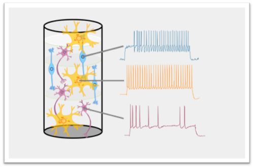

Although the simulation of the biological brain now can fit the unconscious activity for billions of neurons, it is limited by lacking behavioral functions. 

Being inspired by neuroscience, as the most successful design of artificial intelligence up to now, deep learning network lacks compatibility with the biological brain, which limits its explainability and future development. 

The major challenge of using neural data in artificial networks is that we can only obtain a small sample from a huge population during the collection of neural data, and we do not know how much of data is sufficient to reconstruct its functional circuitry. 

We aim to use both extracted high-dimensional neural data and corresponding behavioral data during animals performing cognitive tasks to train artificial networks with different structures and learning mechanism. 

